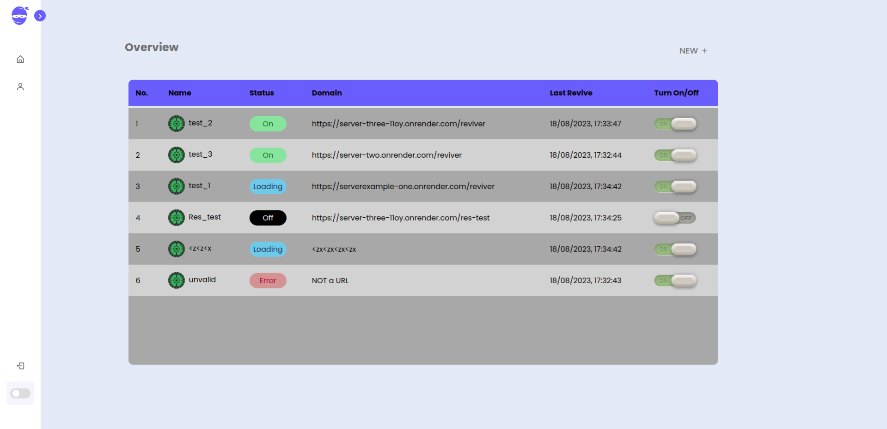

<a id="readme-top"></a>

<!-- PROJECT LOGO -->
<br />
<div align="center">
  <a href="https://github.com/othneildrew/Best-README-Template">
    
  </a>

  <h3 align="center">Hyper Ninja</h3>

  <p align="center">
    Anti Server-Sleeper,  Keeps your Servers Up and Running 
    <br />
    <a href="https://github.com/othneildrew/Best-README-Template"><strong>View Demo</strong></a>
    <br />
    <br />
    <a href="https://github.com/othneildrew/Best-README-Template">View Demo</a>
    ·
    <a href="https://github.com/othneildrew/Best-README-Template/issues">Report Bug</a>
    ·
    <a href="https://github.com/othneildrew/Best-README-Template/issues">Request Feature</a>
  </p>

![TypeScript][TypeScript]

<br>

![HTML5][HTML5]
![CSS][CSS]
![React][React]
![Vite][Vite]
![react-router-dom][react-router-dom]
![Redux][Redux]

![NodeJS][NodeJS]
![ExpressJS][ExpressJS]
![MongoDB][MongoDB]
![Mongoose][Mongoose]
![ENV][ENV]
![JSON-Web-Token][JWT]
![Cookies][Cookies]
![Bcrypt-password-hashing][bcrypt]

</div>

<font size=4>
<details>

  <summary>Table of Contents</summary>
  <ol>
    <li>
      <a href="#about-the-project">About The Project</a>
      <ul>
        <li><a href="#features">Features</a></li>
      </ul>
    </li>
    <li><a href="#usage">Usage</a></li>
    <li>
      <a href="#technologies-used">Technologies Used</a>
      <ul>
        <li><a href="#frontend-🌐">Frontend</a></li>
        <li><a href="#backend-🖥️">Backend</a></li>
      </ul>
    </li>
     <li>
      <a href="#project-structure">Project Structure</a>
      <ul>
        <li><a href="#client-side">Client Side</a></li>
        <li><a href="#server-side">Server Side</a></li>
      </ul>
    </li>
    <li><a href="#used-tech-review">Used Tech Review</a></li>
    <li><a href="#personal-experience">Personal Experience</a></li>
    <li><a href="#acknowledgments">Acknowledgments</a></li>
   
  </ol>
  
</details>
</font>

## About The Project



<br>
<br>
 <font  size=4  >
Hyper Ninja is professionally engineered Full-stack MERN app , that ensures your servers deployed on Render or any other deployment service stay awake and running effortlessly.

Third party deployment servers put each deployed server to sleep (idle state),after 14 minutes of non-usage. This can lead to 30-40 seconds loading time, when the server is in idle state.

<b >In comparison each server that is subscribed in hyper ninja will be up and running with less than 0.5 second loading time.</b>

<span style="color:#695cfe; font-weight:500">\* Registered Servers Stay Active, As long as the user is logged in to his account and Hyper Ninja app is opened in a browser tab.</span>

</font>

<p align="right">(<a href="#readme-top">back to top</a>)</p>

### Features

<font  size=4  style="color:#D4AF37">Empowering users with an array of advanced functionalities. Explore dynamic dashboards, personalized profile management, and more. Discover how these features redefine user interaction:
</font>

- <font  size=4>
       Responsive Expandable Sidebar Offering a seamless Navigation and intuitive user experience.
    </font>
  <br>

- <font  size=4>
     Light and Dark modes,to optimize visual comfort in diverse environments.</font>
  <br>

- <font  size=4>
       A dynamic dashboard efficiently presents subscribed servers, featuring essential details and user-friendly on/off toggles.
    </font>
  <br>

- <font  size=4>
      Complete Server Configuration Page: Users can exercise full control over server settings through a profile page, featuring CRUD operations and an integrated logger screen.
    </font>
  <br>

- <font  size=4>
      User-Centric Profile Management: The user profile page facilitates personalized control with CRUD options, including secure password modification and Account Delete.
    </font>
  <br>

- <font  size=4>
    The app has many Ui Ux features to make it more user-friendly and also comfy to use.
  </font> 
   <br>

- <font  size=4>
      Employing secure cookies, caching, and automatic data refetching, the app ensures data security and optimized performance.
    </font>
  <br>

## Usage (SETUP)

Usage is very Simple but First small setup for each server is required.

This Usage Guide is for NodeJs Express server,
But every server (no matter which programmming language) works on Hyper Ninja,
<b> as long as it has a Get Request with the below JSON OBJECT as Response with Endpoint matches
the registered endpoint in hyper ninja account.</b>

### 1.SETUP Registered Server (NodeJs Express example)

Each registered server, must have simple <b>endpoint setup</b>.
With it's help Hyper Ninja can keep the server Active,
this endpoint is going to handle a <b>GET</b> Request and return this object as JSON Response:

```json
{
  "success": true,
  "data": "revived"
}
```

<font size=5>\* There is Two Different Server setup Methods (Simple & Advanced), to choose from:</font>

#### -) `Simple Server Setup`

I. Open the Entry point file (server.js / index.js) of the server-side code ,

II. COPY and PASTE this in your entry point file:

```js
app.get("/reviver", (_, res) =>
  res.status(200).json({ success: true, data: "revived" })
);
```

#### -) ` Advanced Server Setup`

I.open the Entry point file (server.js / index.js) of the server-side code ,

II.COPY and PASTE this in your entry point file:

```js
app.get("/reviver", (_, res) =>
  setTimeout(
    () => res.status(200).json({ success: true, data: "revived" }),
    5000
  )
);

app.get("*", (_, res) =>
  res.status(404).json({ success: false, data: "Endpoint doesn't exist" })
);
```

- The <b>SetTimeout</b>, provides a better user experience and also gurantees that the server is Activated and functioned for a fixed amount of time , which increase the Hyper Ninja server's Revivng-Mechanism efficiency.
- The <b>`"*"` GLOBAL ENDPOINT</b>, gives Error handling advantage , where the Hyper Ninja server’s Logger
will warn you if the Error is caused by incorrect endpoint.
<p align="right">(<a href="#readme-top">back to top</a>)</p>

### 2. SETUP Hyper Ninja App

<font size=4>
<ul>
<li>
 A) First Register or Login To Your Account
</li>

[![Registeration Page][register-page-img]](https://hyper-ninja.onrender.com/register)

<br>

<li>B) Finally After successful Registeration/Login, you will be Redirected to Your Dashboard Page.


=> Simply Click NEW on the uppper right side of the dashboard
=> then provide your server’s Name and Url

=> Then after the server is successfully registered it will appear in the dashboard ,

=> Clicking on the server’s Dashboard Row , redirects to the Server’s Profile Page,
  where all the Server’s settings and Error Logger are.

  <b> `Remember to keep Hyper Ninja open in The Browser and Logged-in for the server
 to stay Up & Running.`</b>
   </li>
  </ul>
  </font>

![Dashboard][dashboard-img]

## Technologies Used

Building upon a foundation of 100% TypeScript, both the frontend and backend of our application showcase a cohesive and dynamic technology stack.

### Frontend 🌐

1. React Vite (Typescript)
2. Redux ToolKit as state manager
3. Redux ToolKit Query as data fetching and caching tool
4. 100% Pure CSS
5. React-router-dom with `createBrowserRouter()`

### Backend 🖥️

1. Node js Express (Typescript)
2. Leveraging MongoDB for data storage
3. Mongoose for efficient object modeling
4. User Auth System:

   I. JSON Web Token (JWT) for secure authentication

   II. Cookies with HTTP-only and server-side access for enhanced security

   III.Password Hashing with bcrypt Package

5. cors() with credentials and strict origin
6. ENV Configured
7. ExpressJS AsyncHandler
8. Error Handler

<p align="right">(<a href="#readme-top">back to top</a>)</p>

## Project Structure

### Client Side

Contributions are what make the open source community such an amazing place to learn, inspire, and create. Any contributions you make are **greatly appreciated**.

If you have a suggestion that would make this better, please fork the repo and create a pull request. You can also simply open an issue with the tag "enhancement".
Don't forget to give the project a star! Thanks again!

1. Fork the Project
2. Create your Feature Branch (`git checkout -b feature/AmazingFeature`)
3. Commit your Changes (`git commit -m 'Add some AmazingFeature'`)
4. Push to the Branch (`git push origin feature/AmazingFeature`)
5. Open a Pull Request

<p align="right">(<a href="#readme-top">back to top</a>)</p>

### Server Side

<!-- LICENSE -->

## Used Tech Review

Distributed under the MIT License. See `LICENSE.txt` for more information.

<p align="right">(<a href="#readme-top">back to top</a>)</p>

<!-- CONTACT -->

## Personal Experience

Your Name - [@your_twitter](https://twitter.com/your_username) - email@example.com

Project Link: [https://github.com/your_username/repo_name](https://github.com/your_username/repo_name)

<p align="right">(<a href="#readme-top">back to top</a>)</p>

<!-- ACKNOWLEDGMENTS -->

## Acknowledgments

Use this space to list resources you find helpful and would like to give credit to. I've included a few of my favorites to kick things off!

- [Choose an Open Source License](https://choosealicense.com)
- [GitHub Emoji Cheat Sheet](https://www.webpagefx.com/tools/emoji-cheat-sheet)
- [Malven's Flexbox Cheatsheet](https://flexbox.malven.co/)
- [Malven's Grid Cheatsheet](https://grid.malven.co/)
- [Img Shields](https://shields.io)
- [GitHub Pages](https://pages.github.com)
- [Font Awesome](https://fontawesome.com)
- [React Icons](https://react-icons.github.io/react-icons/search)

<p align="right">(<a href="#readme-top">back to top</a>)</p>

[register-page-img]: /readme_assets/register_page.gif
[dashboard-img]: /readme_assets/dashboard.gif
[TypeScript]: https://img.shields.io/badge/built%20with%20typescript-%23007ACC.svg?style=for-the-badge&logo=typescript&logoColor=white
[React]: https://img.shields.io/badge/react-%2320232a.svg?style=for-the-badge&logo=react&logoColor=%2361DAFB
[Vite]: https://img.shields.io/badge/vite-%23646CFF.svg?style=for-the-badge&logo=vite&logoColor=white
[Redux]: https://img.shields.io/badge/redux-%23593d88.svg?style=for-the-badge&logo=redux&logoColor=white
[HTML5]: https://img.shields.io/badge/html5-%23E34F26.svg?style=for-the-badge&logo=html5&logoColor=white
[CSS]: https://img.shields.io/badge/CSS3-1572B6.svg?style=for-the-badge&logo=CSS3&logoColor=white
[react-router-dom]: https://img.shields.io/badge/React_Router-CA4245?style=for-the-badge&logo=react-router&logoColor=white
[NodeJS]: https://img.shields.io/badge/Node.js-339933.svg?style=for-the-badge&logo=nodedotjs&logoColor=white
[ExpressJS]: https://img.shields.io/badge/express.js-%23404d59.svg?style=for-the-badge&logo=express&logoColor=%2361DAFB
[MongoDB]: https://img.shields.io/badge/MongoDB-%234ea94b.svg?style=for-the-badge&logo=mongodb&logoColor=white
[Mongoose]: https://img.shields.io/badge/Mongoose-880000.svg?style=for-the-badge&logo=Mongoose&logoColor=white
[JWT]: https://img.shields.io/badge/JSON%20Web%20Tokens-000000.svg?style=for-the-badge&logo=JSON-Web-Tokens&logoColor=white
[Cookies]: https://img.shields.io/badge/Cookies-D4AA00.svg?style=for-the-badge&logo=Cookiecutter&logoColor=white
[bcrypt]: https://img.shields.io/badge/Bcrypt%20Password%20Hashing-003B57.svg?style=for-the-badge&logo=Spring-Security&logoColor=white
[ENV]: https://img.shields.io/badge/.ENV-ECD53F.svg?style=for-the-badge&logo=dotenv&logoColor=black
